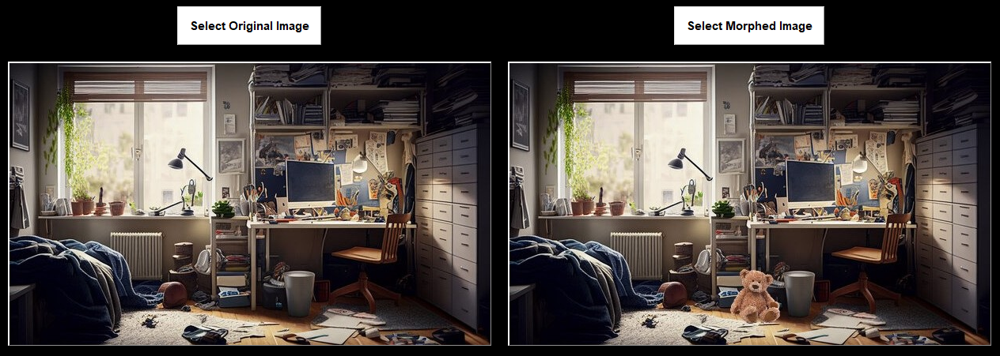

# Image Forensics Tool

This repository contains a Python-based application designed to perform image forensics analysis, specifically focusing on edge detection and comparing original and morphed images. It uses **OpenCV**, **Tkinter**, and **Matplotlib** for image processing, GUI, and displaying analysis results.

## Features

- **Load and Display Images**: Select and display two images (Original and Morphed).
- **Edge Detection**: Computes edge detection using Canny edge detector for both images.
- **Difference Visualization**: Highlights the difference between the two images in **red**.
- **Forensics Analysis**: Computes and displays the count of edges detected in both images.
- **Graphical Representation**: Displays a bar graph comparing the edge counts of the original and morphed images.

Input:

Output: 

